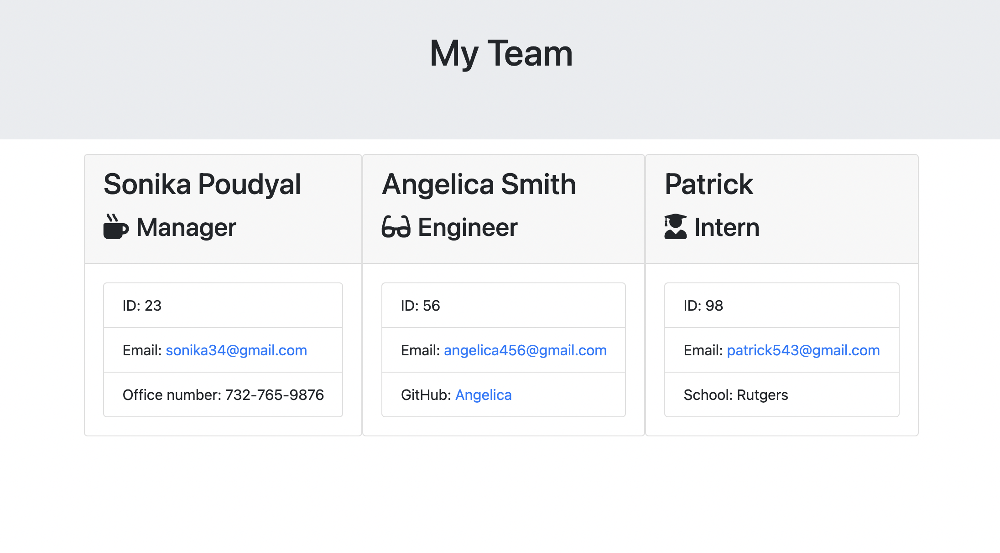

# Team Profile Generator

## Description
This is a application built based on Node.js command-line that takes in information about employees on a software engineering team that is written in command line and generates an HTML webpage that displays summaries for each person. 

---

## Built With
* Java Script
* Node.js
* OOP 
* TDD
* ES6

---

## Link to video

<iframe src="https://drive.google.com/file/d/1od9ICfUksAsDA1HAhAMyq7jaW9ptOxRH/preview" width="640" height="480"></iframe>

Google drive link:
[Click Here](https://drive.google.com/file/d/1od9ICfUksAsDA1HAhAMyq7jaW9ptOxRH/view)

---

## ScreenShot

---

Starter Code was given by Kevin, the instructor of the class, which included HTML templates, the tests and htmlRenderer.js file. 

---

## Contribution
Made with love by Sonika Poudyal 
